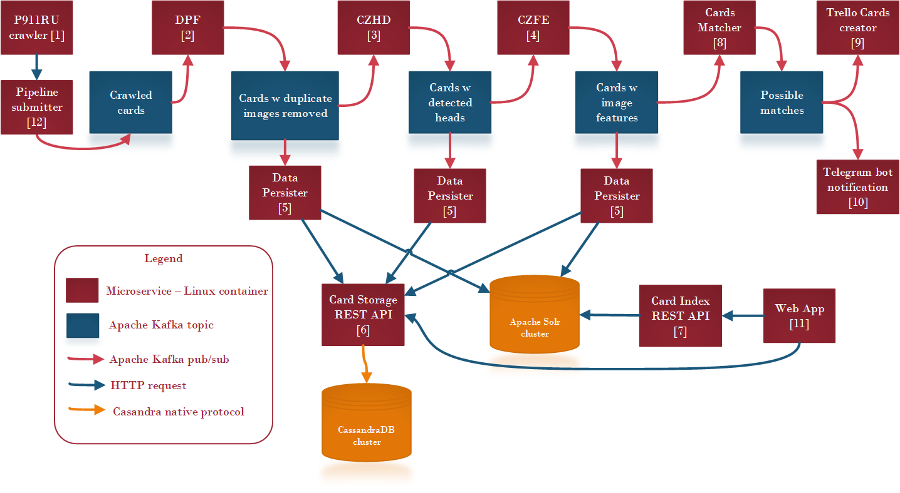

# Kashtanka
The repo holds the configuration of [kashtanka.pet](https://kashtanka.pet) deployed production solution.
Also it is the monorepo for some microservices.

## Architecture

The system is designed to be horizontally scalable and without single point of failure.
It is composed of microservices, each of which is Linux container.
The microservices use either HTTP requests or Apache Kafka topics to communicate between each other.
The production system runs on top of Kubernetes, but nobody stops you from running it as a set of Docker container on a single machine.

## Dataflow diagram & microservices

The table lists microservices depicted on the figure.
|Num in figure| Full Name | Description | Code location | Latest release |
|----------|----------|---------|-------------|-------|
|  1       | Pet911ru crawler | Periodically crawles new card on [pet911.ru](https://pet911.ru) | [Standalone repo](https://github.com/LostPetInitiative/Crawler) |  |
|  2       | Duplicate Photo filter | removes duplicated photos from cards | [Separate directory](https://github.com/LostPetInitiative/Kashtanka/tree/main/images/imageDuplicateRemovalService) |  |
|  3       | Calvin-Zhirui pet head detector | Detects pet heads by appling YoloV5 | [Standalone repo](https://github.com/LostPetInitiative/Calvin_Zhirui_Yolo5_head_detector) |    |
|  4       | Calvin-Zhirui fine grained classification feature extractor | Feature extractor based on Twin Transformer | [Standalone repo](https://github.com/LostPetInitiative/Calvin_Zhirui_Feature_Extractor) |     |
|  5       | Data persister | Persists the cards, processed images and feature vectors to the persistent storage or index | [Separate directory](https://github.com/LostPetInitiative/Kashtanka/tree/main/images/processedCardsPersister) |   | 
|  6       | Card Storage REST API | Provides HTTP access to the pet cards storage | [Standalone repo](https://github.com/LostPetInitiative/CardStorageRestAPI) |  |
|  7       | Card Index REST API | Provices HTTP access to the index of pet cards | [Standalone repo](https://github.com/LostPetInitiative/CardIndexRestAPI) |  |
|  8       | Card matcher | Queries the index to get possible lost/found cards match | [Standalone repo](https://github.com/LostPetInitiative/CardMatcher) |  |
|  9       | Trello card creator | Creates Trello cards with found matched for human evaluation | [Separate directory](https://github.com/LostPetInitiative/Kashtanka/tree/main/images/trelloCardCreator) |   | 
|  10      | Telegram notifier | Sends messages about new found matches into the Telegram channel | RBD |   |
|  11      | Web app | The web application of the system  | [Standalone repo](https://github.com/LostPetInitiative/WebApp) |  |
|  12      | Pipeline submitter | REST API for pushing cards into ML data processing pipeline | [Separate directory](https://github.com/LostPetInitiative/Kashtanka/tree/main/images/crawlerPet911ruPipelineNotifier)|   |
|  13      | Poiskzoo.ru crawler | Periodically crawles new card on [poiskzoo.ru](https://poiskzoo.ru) | [Standalone repo](https://github.com/LostPetInitiative/poiskzoo-ru-crawler)|   |
|  14      | Kafka REST API | REST API for pushing any messages to Kafka topics | [Separate directory](https://github.com/LostPetInitiative/Kashtanka/tree/main/images/kafkaRestAPI)|   |

## Prerequisites
To deploy your own instance of kashtanka.pet you will need:
1. Linux container environment (k8s / single docker daemmon / etc.)
2. Apache Kafka cluster
2. CassandraDB cluster
3. Apache Solr 9.0 cluster

# Kubernetes configuration
yaml files which define the cloud system are located in `k8s` directory.
